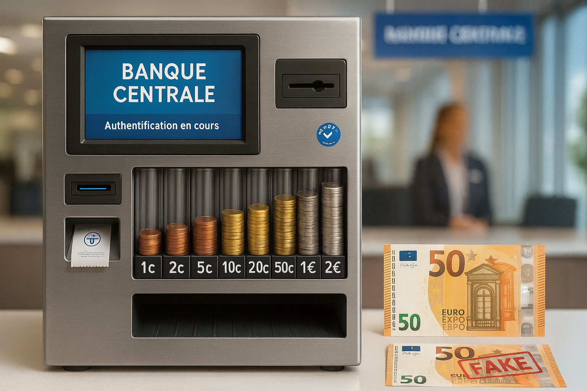
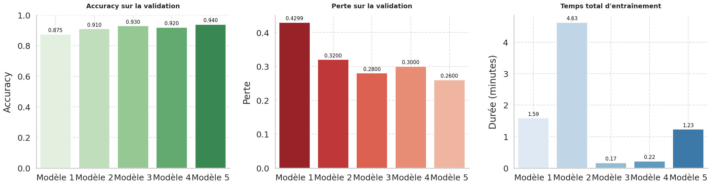

# Prédiction et Vérification de Monnaie : Pièces d’Euros et Billets Frauduleux


---

<p align="center">
  
</p>

# **Problématique de la Banque Nationale de la Sécurité Monétaire (BNSM)**
La **BNSM** fait face à une recrudescence de fausse monnaie en circulation, affectant la confiance du public et la stabilité économique.
Afin d’assurer une **meilleure traçabilité et sécurité** des transactions physiques, la BNSM souhaite développer un **système automatisé** capable de :

- Identifier rapidement la valeur des pièces d’euro à partir d’une image.

- Détecter les faux billets à partir de leurs caractéristiques physiques mesurées.

Ce projet a donc pour but de fournir une solution d’**intelligence artificielle** fiable, rapide et intégrée, utilisable aussi bien dans les guichets automatiques que dans les agences bancaires.

---

##  **Objectif du projet**

la **reconnaissance automatique** de la valeur d’une **pièce d’euro** à partir d’une image,

la **détection de faux billets** à partir de leurs caractéristiques dimensionnelles.

L’ensemble est intégré dans une interface **Streamlit unique**, intuitive et accessible via le **cloud**.

---

##  **Fonctionnalités principales**

-  **Identification automatique des pièces d’euro** (1c, 2c, 5c, 10c, 20c, 50c, 1€, 2€)
-  **Vérification d’authenticité des billets** à partir de leurs mesures physiques (diagonal, height_left, etc.)
-  **Affichage des probabilités** de prédiction et du niveau de confiance
-  **Temps d’inférence** et **niveau de confiance** affichés en direct
-  **Téléchargement automatique des poids du modèle** depuis Google Drive
-  **Deux IA complémentaires** :
    - VGG16 (Deep Learning) pour la **vision par image**
    - Random Forest (Machine Learning) pour la **détection de contrefaçons**
---

##  **Architecture des modèle finaux**
## **1. Reconnaissance automatique de la valeur d’une pièce d’euro**

Le modèle final est basé sur **VGG16 (ImageNet)** en *feature extraction* + *fine-tuning* partiel des couches du bloc 5.
            
**Structure simplifiée :**
```python
VGG16 (include_top=False)
↓
Flatten()
↓
Dense(256, activation='relu')
↓
Dropout(0.32)
↓
Dense(8, activation='softmax')
            
            
```
            
## Application de Reconnaissance de Pièces
            
Les poids finaux (`model_weights_final.weights.h5`) sont automatiquement téléchargés au lancement de l’application.
            
## Comparaison des modèles développés
            
Durant la phase de recherche, 5 modèles ont été conçus et comparés pour déterminer la meilleure approche.
            
| # | Modèle | Type | Data Augmentation | Régularisation | Optimisation | Normalisation | Fine-Tuning | Callbacks |
|---|--------|------|-----------------|----------------|-------------|---------------|-------------|-----------|
| 1 | CNN simple | CNN baseline | ❌ | ❌ | Manuel | ❌ | ❌ | ❌ |
| 2 | CNN optimisé | CNN + Optuna | ✅ | ✅ | Optuna | ✅ | ❌ | ✅ |
| 3 | VGG16 (Feature Extraction) | Pré-entraînement | ❌ | ✅ | Optuna | ✅ | ❌ | ✅ |
| 4 | VGG16 (Feature Extraction + Data Augmentation) | Avancé | ✅ | ✅ | Optuna | ✅ | ❌ | ✅ |
| 5 | VGG16 Fine-Tuning | Final | ✅ | ✅ | Optuna | ✅ | ✅ | ✅ |
            
---
            
## **Résultat :**  
            
            

            
            
Le modèle 5 **(VGG16 Fine-Tuning)** a obtenu la meilleure précision et robustesse, justifiant son intégration dans l’application Streamlit.

---

## **2. La détection de faux billets à partir de leurs caractéristiques dimensionnelles**

**Variables** : diagonal, height_left, height_right, margin_low, margin_up, length
            
**Cible** : is_genuine → 1 (vrai billet) / 0 (faux billet)
            
### **Préparation & Modélisation**
            
Les données ont été :
            
- **nettoyées** (gestion des valeurs manquantes, doublons, outliers),
            
- normalisées via **StandardScaler**,
            
- séparées en **jeu d’entraînement et de test** (80/20).
            
**Trois modèles** ont été entraînés et comparés :
            
- Régression Logistique	
- Random Forest	
- XGBoost	


Le **Random Forest optimisé** a été retenu pour l’application finale.
            
            
**Structure simplifiée du pipeline**
```           
StandardScaler()
↓
RandomForestClassifier
↓
Prédiction : 1 (vrai) / 0 (faux)
```
            
Ces modèles sont automatiquement téléchargés depuis Google Drive au lancement.
            
---
## Interface Streamlit

L’application propose un menu de navigation pour choisir entre les deux modules :

|                Option               |                        Description                             |
|-------------------------------------|----------------------------------------------------------------|
| Vérifier l'authenticité d'un billet |	Entrée manuelle des dimensions → Prédiction "Vrai" ou "Faux"   |
|Identifier une pièce d’euro	      |Téléversement d’une image → Prédiction automatique de la valeur |

---

## Technologies utilisées

- **Langage :** Python  
- **Optimisation :** Optuna, MLflow, GridSearchCV / Cross-Validation
- **Front-End :** Streamlit  
- **Visualisation :** Matplotlib, Seaborn  
- **Modèle de base :** VGG16 (ImageNet)
- **IA & ML :**	TensorFlow / Keras / Scikit-learn / XGBoost
- **Sauvegarde :**	Joblib / Google Drive

---

